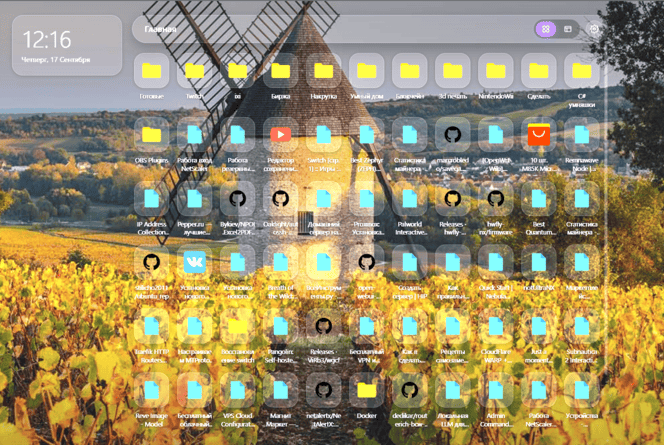
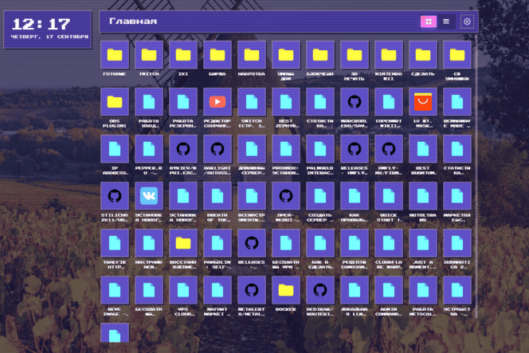

# tambulated

Chrome-расширение (Manifest V3), заменяющее новую вкладку менеджером закладок на Vue 3 + Vite.

### Как выглядит
Классическая тема

8-bit

### Загрузка в Chrome

Не регистрировался в Google Console так как увидел сбор 5$, а в наличии жадность и отсутствие карты Мастеркард или Виза

0. Собрать расширение командой `npm run build`, создастся папка `dist`
1. `chrome://extensions` → включить «Режим разработчика»
2. «Загрузить распакованное расширение» → выбрать папку `dist`

## Возможности

- **Плиточный / табличный** режимы просмотра закладок (переключатель в тулбаре, выбор сохраняется).
- **Навигация по папкам** — хлебные крошки, «Главная» как drop-зона.
- **Drag & drop** — перемещение закладок и папок (всегда включён).
- **Контекстное меню** (ПКМ): открыть, переименовать, удалить закладку/папку, создать новую папку (по ПКМ на пустом месте).
- **Темы** — `system` / `light` / `dark` / `retro`, выбор сохраняется.
- **i18n** — локализация: русский / English / 中文; язык по умолчанию определяется из системного, выбор сохраняется.

## Скрипты

| Команда | Описание |
|---|---|
| `npm run serve` | Dev-сервер Vite (`localhost:8081`) |
| `npm run build` | Прод-сборка в `dist/` |
| `npm run preview` | Просмотр собранного `dist/` |
| `npm run lint` | ESLint (`eslint src --fix`) |
| `npm run test` | Unit-тесты (Vitest, однократный прогон) |
| `npm run test:watch` | Unit-тесты в watch-режиме |